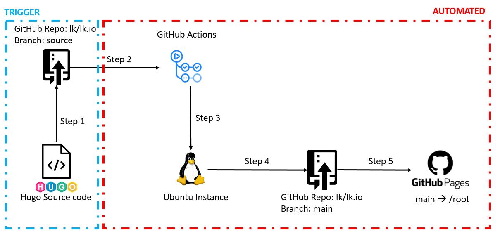

# Building of this site
The Liamkenneally.co.uk website is generated using a static website generator known as Hugo. The Hugo framework, plus many available themes created by developers allows for a quick and easy way to deploy a site/blog like the one you are currently viewing. 

I personally do not enjoy creating the front end of a website and I am quite frankly rubbish at it! So I grabbed a theme that would allow me to create a personal bio and provide a platform for me to create my blog posts.

What I did want to achieve, was the ability to deploy my content in a programmatic way for all future blog posts. They would all follow the same blog template and would be written in a consistent way (markdown)

The below process walks through the generation of this site:

## Step 1 - Hugo Source Code 
I create my site locally on my laptop. I use the Hugo server to generate a local webserver to present what the site will look like when rendered. 

Once I am happy with my website content, I commit my Github changes and push them to my source branch

Github has a special repo known as https://github.com/username/username.github.io this repo provides the ability to map a branch of the repo to GitHub pages /root directory to host a static website at the URL of https://username.github.io more information can be found at the GitHub Pages website.

In the illistration above "lk/lk.io" = https://github.com/username/username.github.io

## Step 2/3 - Git Push and GitHub Actions
Upon pushing the code to my source branch, an "Action" is triggered by GitHub Actions. This Action, spins up a Linux Ubuntu Instance on GitHubs platform and runs some Hugo commands to generate all the static HTML files from the Hugo source code pushed to my "Source" branch.

## Step 4 - Static HTML generation pushed to main
The generated static HTML content created by the Linux Instance in step 3 is then pushed to my "main" branch in the repo.

## Step 5 - Content served from /root
The "main" branch in my repo is set as the /root folder for my GitHub pages. Meaning tha the static HTML files will be server by GutHub pages.

## Some additional steps 
I have a persobalised domain name liamkenneally.co.uk. 
So I have configured my DNS provider to forward (A record) all requests for liamkenneally.co.uk to GitHub pages public IP addresses

I have also updated the CNAME of GitHub pages to redirect liamkenneally.github.io --> liamkenneally.co.uk